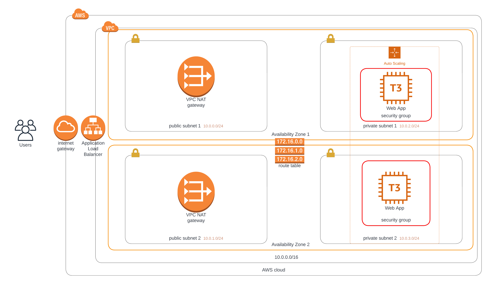

### Udagram Deploy a high-availability web app using CloudFormation
Welcome to Udacity cloud devops second project!

## Project diagram


## To run the project for the first time
```
1. Run network stack first

$ ./create.sh udagram-network network.yml network-parameter.json 

2. Run server stack second

$ ./create.sh udagram-server server.yml server-parameter.json
```

## To update the project for the next times after creation
```
1. For network stack

$ ./update.sh udagram-network network.yml network-parameter.json 

2. For server stack 

$ ./update.sh udagram-server server.yml server-parameter.json
```

## To delete the stack
```
1. Delete server stack first

$ ./delete.sh udagram-server

2. Then delete network stack

$ ./delete.sh udagram-network
```